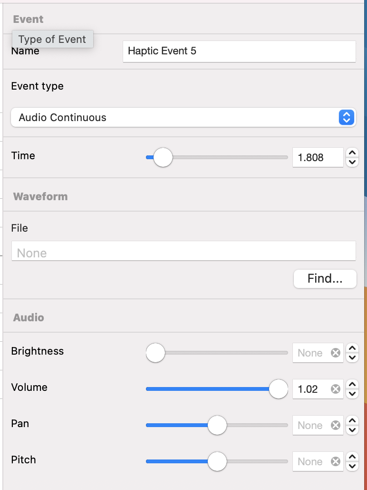

# Audio Continuous

---
Navigation: [README](README.md) - [EventType](EventType.md)
---

---

### 

### Name

[Event Name](EventName.md)

### Event Type

[Events](EventType.md)

### Time

[Time](Time.md)

### File

[Audio Waveform](AudioWaveform.md)

### Brightness

[Audio Brightness](AudioBrightness.md)

### Volume

[Audio Volume](AudioVolume.md)

### Pan

[Audio Pan](AudioPan.md)

### Pitch

[Audio Pitch](AudioPitch.md)

---

If you didn't find what you were looking for, please [send me a message](mailto:contact+help@haptrix.com)