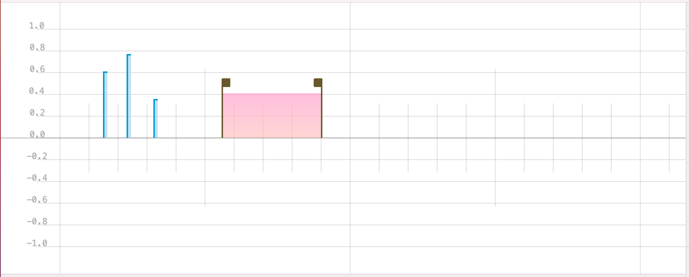

# Canvas

---
Navigation: [README](README.md) - [Layout](Layout.md)
---

---

### Canvas

The canvas is where you will add your Haptic Events, in most cases, you can click to add an item, or use the currently selected tool

---

If you didn't find what you were looking for, please [send me a message](mailto:contact+help@haptrix.com)