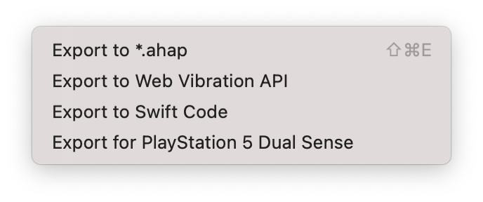

# Exporting from Haptrix

---
Navigation: [README](README.md) - [Layout_Toolbar](Layout_Toolbar.md)
---

Haptrix supports multiple export formats

---

### Export to *.AHAP File

The default option Haptrix supports is writing to AHAP files directly, these are the files which are supported natively by iOS 

### Export to Web Vibration API

Mobile Browsers like Chrome support the Web Vibration API, by using Javascript you can play a basic version of a Core Haptic file

[https://developer.mozilla.org/en-US/docs/Web/API/Vibration_API](https://developer.mozilla.org/en-US/docs/Web/API/Vibration_API)

### Export to Swift Code

Haptrix can also generate pure Swift code for your Haptic, whilst it is easier to use a AHAP file, sometimes you may wish to write code

### Export for Game Controllers

PlayStation 5 Dual Sense and Xbox Series X Controllers support Core Haptics, this export option allows you to export setup code to run you Haptic Experience.If you connect a controller to your Mac, you can use run on device just like an iPhone to feel the vibration.Multiple controllers can be connected at once.

---

If you didn't find what you were looking for, please [send me a message](mailto:contact+help@haptrix.com)