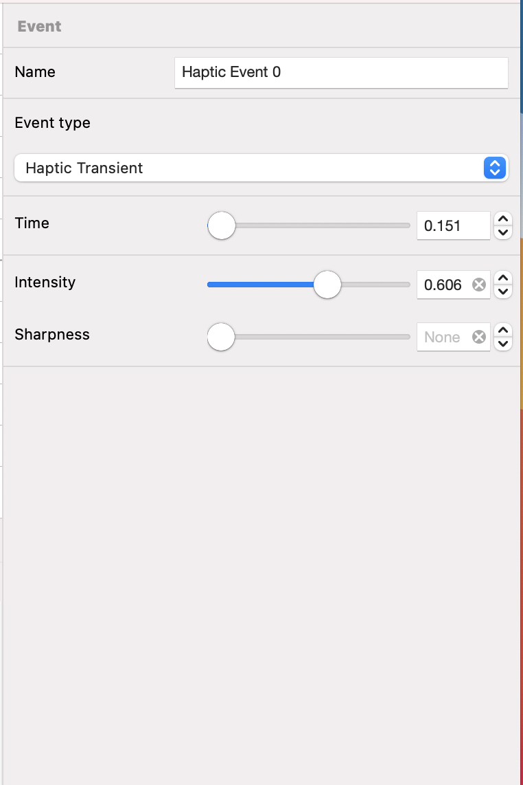

# Haptic Transient

---
Navigation: [README](README.md) - [EventType](EventType.md)
---

---

### What is a Transient?

The most commonly use Haptic Event is the Transient event, like hitting a drum, the effect is instant and lasts very briefly

### Name

Identifiable name

[Event Name](EventName.md)

### Event Type

[Events](EventType.md)

### Time

[Time](Time.md)

### Sharpness

[Sharpness](Sharpness.md)

### Intensity

[Intensity](Intensity.md)

---

If you didn't find what you were looking for, please [send me a message](mailto:contact+help@haptrix.com)