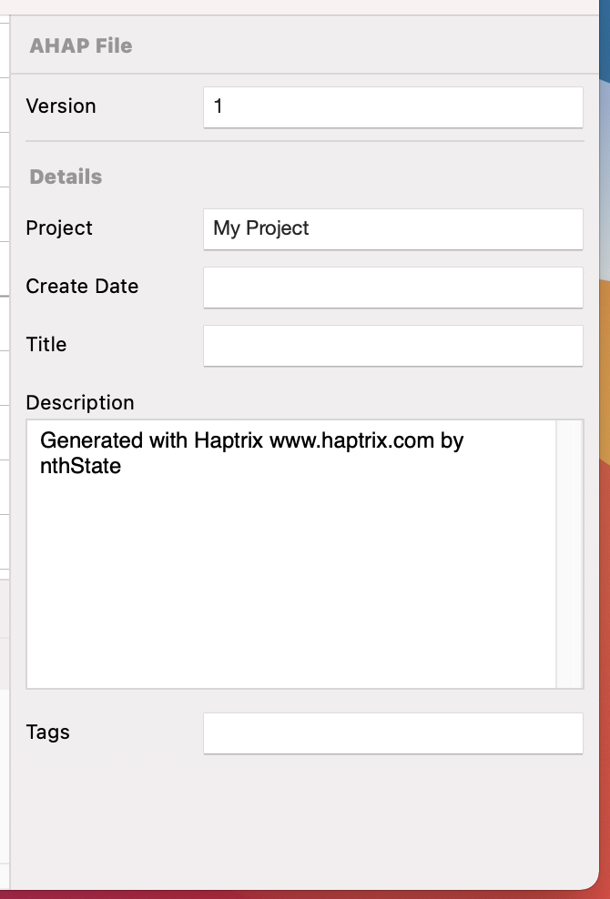

# App Layout

---
Navigation: [README](README.md)
---

Haptrix is laid out into three main screens, the canvas, where you draw, the inspector where you can refine, and the timeline where you can quickly find a specific event

---

### Menu

[Menu](Menu.md)

### Toolbar

Quick Access to swap between Haptic Events, Uploading and Running on Device

[Toolbar](Layout_Toolbar.md)

### Canvas

Your main work area

[Canvas](Canvas.md)

### Timeline

A list of Haptic Events

[Timeline](Layout_Timeline.md)

### Inspector

Change the individual properties of Haptic Elements, or configure project settings

[Inspector](Inspector.md)

### Dark Mode

Haptrix supports DarkMode for both its macOS & iOS Apps

[Dark Mode](DarkMode.md)

---

If you didn't find what you were looking for, please [send me a message](mailto:contact+help@haptrix.com)