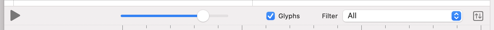

# Timeline Toolbar

---
Navigation: [README](README.md) - [Layout](Layout.md) - [Layout_Timeline](Layout_Timeline.md)
---

---

### 

The Timeline has a Toolbar which contains quick actions.

### What is the Timeline Toolbar?

The Timeline Toolbar sits above the Toolbar and offers quick and often used actions when designing your Haptics

### Play/Stop Button

If you have Audio in your Project, using the Play button will play the first audio file, it's useful for checking if your events are firing in the right place

### Zoom Slider

The zoom slider allows you to quickly zoom in and out of the canvas

### Show/Hide Glyphs

Toggle the visibility of glyphs

[Glyphs](CanvasGlyphs.md)

### Filter Events

If you want to display only a certain type of events, use this dropdown to change the visibility of events, or view them all

### Sort Events

Sort the events by start time in the timeline, you can sort Ascending or Descending

[Timeline](Layout_Timeline.md)

## Related
---

- [Layout_Toolbar](Layout_Toolbar.md)

---

---

If you didn't find what you were looking for, please [send me a message](mailto:contact+help@haptrix.com)