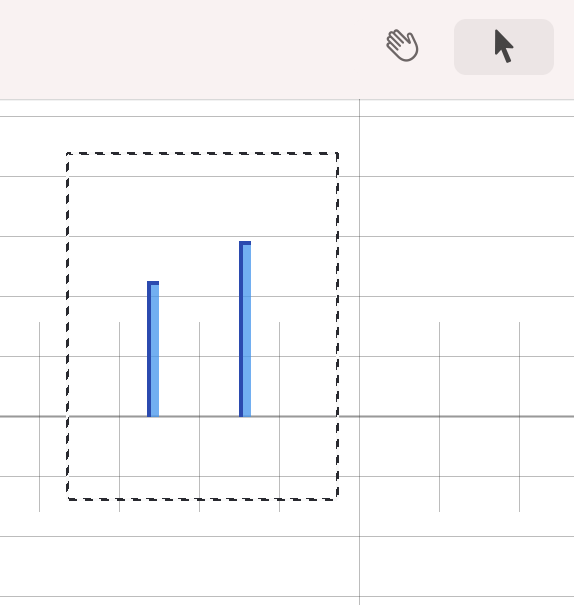

# Mouse Operations

---
Navigation: [README](README.md) - [Operating](Operating.md)
---

---

### Window Selection Tool

Whilst the Arrow tool is selected, holding down the Command Key allows you to draw a selection around multiple items. This allows you to select the items at once for Multiple Select

[Multiple Select](OperatingMultipleSelect.md)

### Space Drag

If you hold space and then drag your mouse/trackpad, then the canvas will pan

---

If you didn't find what you were looking for, please [send me a message](mailto:contact+help@haptrix.com)