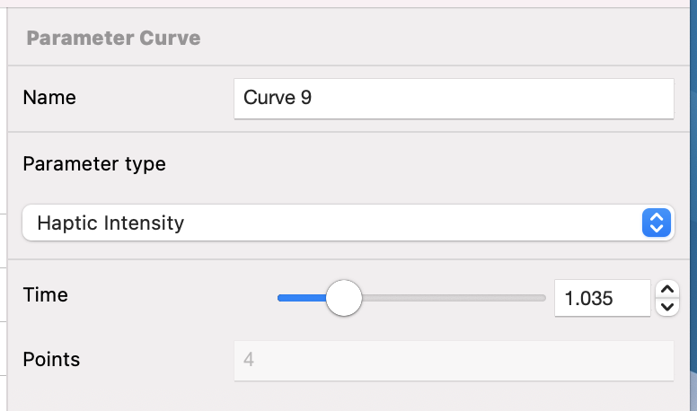

# Parameter Curve

---
Navigation: [README](README.md) - [EventType](EventType.md)
---

---

### What is a Parameter Curve?

### What is a Parameter Curves' Parameter Type?

Intensity, Sharpness, Brightness, Pan, Pitch, Volume

### Name

Identifiable name

### Parameter Type

What should parameter over the Haptic should be modulated by this curve?

### Time

[Time](Time.md)

### Points

[Parameter Curve Point](ParameterCurvePoint.md)

## Related
---

- [ParameterCurvePoint](ParameterCurvePoint.md)

---

---

If you didn't find what you were looking for, please [send me a message](mailto:contact+help@haptrix.com)