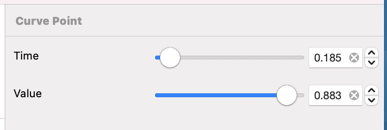

# Parameter Curve Point

---
Navigation: [README](README.md) - [EventType](EventType.md) - [ParameterCurve](ParameterCurve.md)
---

---

### What is a Parameter Curve Point

A curve can contain many points, and if you step back, you can see all the points together look like a curve. At a high point, the modulated value is high. At a low point, the modulated value is low

### Time

Time in a Parameter Curve Point is relative to the start time of the parent Parameter Curve

### Value

Dependant on the type of the parent Parameter Curve, the Value can be between -1 to +1

## Related
---

- [ParameterCurve](ParameterCurve.md)

---

---

If you didn't find what you were looking for, please [send me a message](mailto:contact+help@haptrix.com)